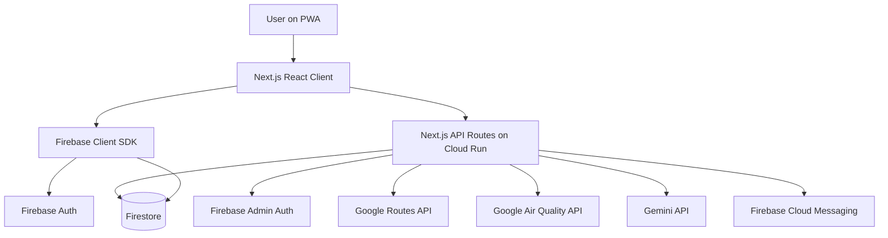

# Airu Planning & Architecture

Status: completed for issue #1, phase 1.

Source: `AIRU-DEVELOPMENT-GUIDE.md`.

## Scope

This document locks the initial product, architecture, API, data model, and milestone plan for Airu. It is intentionally implementation-ready, but it does not include UI mockups, backend code, infrastructure provisioning, or production credentials.

## Product Summary

Airu is a mobile-first PWA that helps pedestrians and cyclists compare the fastest route with a healthier route by combining Google Routes, Google Air Quality data, route context, and AI-generated recommendations in Bahasa Indonesia.

The core product promise is simple: the quickest route is not always the best route when pollution, heat, shade, and user health sensitivity are considered.

## User Stories

| ID | Actor | Story | Value | Priority |
|---|---|---|---|---|
| US-001 | Pedestrian | I can enter origin and destination and compare at least two routes. | I can choose between fastest and healthier routes. | Must |
| US-002 | User with asthma | I can save health conditions in my profile. | Route recommendations account for my sensitivity. | Must |
| US-003 | General user | I can see air quality scores per route segment. | I know which parts of a route are risky. | Must |
| US-004 | Parent | I can enable family mode. | I can judge whether a route is suitable for children. | Should |
| US-005 | Commuter | I can receive alerts when AQI gets worse. | I can adjust travel plans earlier. | Should |
| US-006 | All users | I can read an AI recommendation in Bahasa Indonesia. | I understand the reasoning, not just the score. | Must |
| US-007 | All users | I can view route history. | I can track personal pollution exposure over time. | Could |
| US-008 | Cyclist | I can choose bicycle mode. | Generated routes fit cycling needs. | Should |

## Functional Requirements

| ID | Requirement | Acceptance Criteria |
|---|---|---|
| FR-01 | Users can input origin and destination via Places Autocomplete or GPS. | Search accepts typed places and current location coordinates. |
| FR-02 | The system returns at least fastest and healthiest route options. | Route analysis response contains `fastest` and `healthiest` objects. |
| FR-03 | Each route has a Health Score from 0 to 100. | Score is returned as an integer and is based on weighted segment scores. |
| FR-04 | Route polylines can be colored per segment. | Each route segment includes coordinates, AQI, health score, and risk level. |
| FR-05 | Gemini produces Bahasa Indonesia recommendations with streaming support. | Recommendation endpoint supports streaming response text. |
| FR-06 | Users can save health profile settings. | Firestore `/users/{uid}` stores conditions, travel mode, and alert preferences. |
| FR-07 | FCM sends alerts when AQI exceeds a user threshold. | Alert records are created and FCM is sent for subscribed users. |
| FR-08 | Route history is stored in Firestore. | Route analysis can persist under `/routes/{routeId}` for the signed-in user. |
| FR-09 | The app is installable as a PWA. | Manifest and service worker are planned for frontend phase. |
| FR-10 | AQI lookups are cached for 30 minutes. | `/aqi_cache/{geohash6}` entries older than 30 minutes are treated as stale. |

## Non-Functional Requirements

| ID | Requirement | Target |
|---|---|---|
| NFR-01 | Route analysis latency | P95 under 5 seconds for normal routes. |
| NFR-02 | Availability | 99.5% target using Cloud Run managed platform. |
| NFR-03 | Responsiveness | Mobile-first at 375px, tablet at 768px, desktop at 1280px. |
| NFR-04 | Secret handling | Server-side secrets stored in Google Secret Manager. |
| NFR-05 | Firestore authorization | Users only read and write their own user-owned documents. |
| NFR-06 | AQI freshness | Cached AQI must not be older than 30 minutes. |

## Tech Stack Decision

| Layer | Choice | Reason |
|---|---|---|
| Web framework | Next.js 14 App Router | Combines React UI and server API routes in one deployable app. |
| Language | TypeScript 5 | Shared contracts and type safety across client and server. |
| Styling | Tailwind CSS 3 | Fast implementation with explicit design tokens. |
| Motion | Framer Motion 11 | Bottom sheet and route result transitions. |
| Maps UI | `@react-google-maps/api` | React integration for Google Maps JavaScript API. |
| Routes | Google Routes API | Route alternatives, polyline, travel mode support. |
| Air quality | Google Air Quality API | AQI, pollutant indexes, and category data. |
| AI | `@google/generative-ai` with Gemini 2.0 Flash | Low-latency Bahasa Indonesia route explanations. |
| Auth and client DB SDK | Firebase Auth and Firestore | Managed auth and realtime client access where needed. |
| Server admin | `firebase-admin` | Server-side session verification, Firestore writes, and FCM. |
| Cache key | `geofire-common` | Stable geohash cache buckets for nearby AQI lookups. |
| Hosting | Google Cloud Run | Containerized Next.js with autoscaling and revision rollback. |
| CI/CD | Google Cloud Build | Native Google Cloud deployment pipeline. |
| Registry | Artifact Registry | Private Docker images for Cloud Run. |
| Secrets | Google Secret Manager | Avoids committing or baking sensitive keys into the repo. |

## Architecture



### Service Boundaries

| Boundary | Responsibility |
|---|---|
| Client PWA | Search input, map rendering, route comparison, profile settings, notification permission. |
| Next.js API routes | Auth session handling, route analysis orchestration, AQI cache access, Gemini streaming. |
| Firebase Auth | User identity provider and ID token issuance. |
| Firestore | User profiles, route history, AQI cache, alert records. |
| Google APIs | Routes, Maps, Places, Air Quality, Gemini. |
| Cloud Functions or scheduled jobs | AQI cache refresh and FCM alert fanout. |

### Route Analysis Flow

1. Client sends origin, destination, travel mode, and health conditions to `POST /api/route/analyze`.
2. API verifies the Firebase session cookie.
3. API requests route alternatives from Google Routes API.
4. API decodes or samples route polylines into scoring segments.
5. API fetches AQI through Firestore cache by geohash. Stale cache entries older than 30 minutes are refreshed through Google Air Quality API.
6. API calculates segment health scores and route-level weighted averages.
7. API selects the fastest route by duration and healthiest route by health score.
8. API stores the result under `/routes/{routeId}` for authenticated users.
9. Client renders route cards, colored polylines, and optional Gemini recommendation.

## Data Model

```text
/users/{uid}
  email: string
  displayName: string
  photoURL: string | null
  travelMode: "WALK" | "BICYCLE"
  conditions: string[]
  fcmToken: string | null
  alertEnabled: boolean
  alertAQIThreshold: number
  createdAt: timestamp
  updatedAt: timestamp

/routes/{routeId}
  userId: string
  origin: LocationInput
  destination: LocationInput
  travelMode: "WALK" | "BICYCLE"
  fastest: ScoredRoute
  healthiest: ScoredRoute
  aiRecommendation: string | null
  createdAt: timestamp

/aqi_cache/{geohash6}
  geohash: string
  lat: number
  lng: number
  aqi: number
  pm25: number | null
  pm10: number | null
  category: string
  fetchedAt: timestamp

/alerts/{alertId}
  userId: string
  lat: number
  lng: number
  aqi: number
  category: string
  message: string
  isRead: boolean
  sentAt: timestamp
```

## API Design

The initial OpenAPI contract is stored in `docs/openapi.yaml`.

| Method | Endpoint | Auth | Purpose |
|---|---|---|---|
| POST | `/api/auth/session` | Public | Exchange Firebase ID token for secure session cookie. |
| DELETE | `/api/auth/session` | Public | Clear session cookie. |
| GET | `/api/aqi/current` | Required | Return current AQI for `lat` and `lng` using cache. |
| POST | `/api/route/analyze` | Required | Fetch, score, persist, and return fastest and healthiest routes. |
| POST | `/api/ai/recommend` | Required | Stream a Gemini route recommendation in Bahasa Indonesia. |

## Health Score Model

Segment health score uses a weighted score from 0 to 100:

```text
segmentScore =
  aqiScore * 0.40 +
  shadeScore * 0.25 +
  heatScore * 0.20 +
  greeneryScore * 0.15

routeScore = weighted average of segment scores by segment distance
```

Rules:

- Higher score means healthier.
- AQI normalization maps AQI 0 to 500 into a 100 to 0 score.
- Health conditions can apply penalties. Example: asthma increases penalty for PM2.5-heavy AQI.
- Family mode can apply stricter thresholds for caution and danger labels.
- Segment risk labels are `healthy`, `caution`, and `danger`.

## Security Decisions

| Area | Decision |
|---|---|
| Authentication | Firebase Auth on client, Firebase Admin session cookie on server. |
| Session cookie | HttpOnly, Secure in production, SameSite=Strict. |
| Authorization | User-owned Firestore documents are scoped by authenticated UID. |
| Secrets | Server-side API keys and Firebase admin credentials are read from Secret Manager. |
| Public keys | Only browser-safe `NEXT_PUBLIC_*` values may be exposed to client bundles. |
| API abuse | Route analysis and AI recommendation endpoints require per-user rate limiting in backend phase. |

## Milestones

| Milestone | Scope | Target |
|---|---|---|
| M1 - Foundation | Next.js setup, TypeScript, Tailwind, Firebase config, env template, auth shell. | Day 1 |
| M2 - Map and Search | Google Maps, Places Autocomplete, current location, travel mode selection. | Day 1-2 |
| M3 - Core Analysis | Routes API, Air Quality API cache, route scoring, Firestore persistence. | Day 2-3 |
| M4 - Result Experience | Route comparison UI, colored polyline segments, Gemini streaming. | Day 3 |
| M5 - Alerts | FCM token handling, AQI alert rules, scheduled refresh, alert list data. | Day 4 |
| M6 - Polish and Deploy | PWA, responsive QA, Cloud Run container, Cloud Build pipeline. | Day 4 |

## Phase 1 Acceptance

- User stories and functional requirements are defined.
- Tech stack choices and rationale are documented.
- Service architecture, API boundaries, data model, and scoring model are documented.
- Initial OpenAPI contract exists for backend implementation.
- Milestones and timeline are defined.
